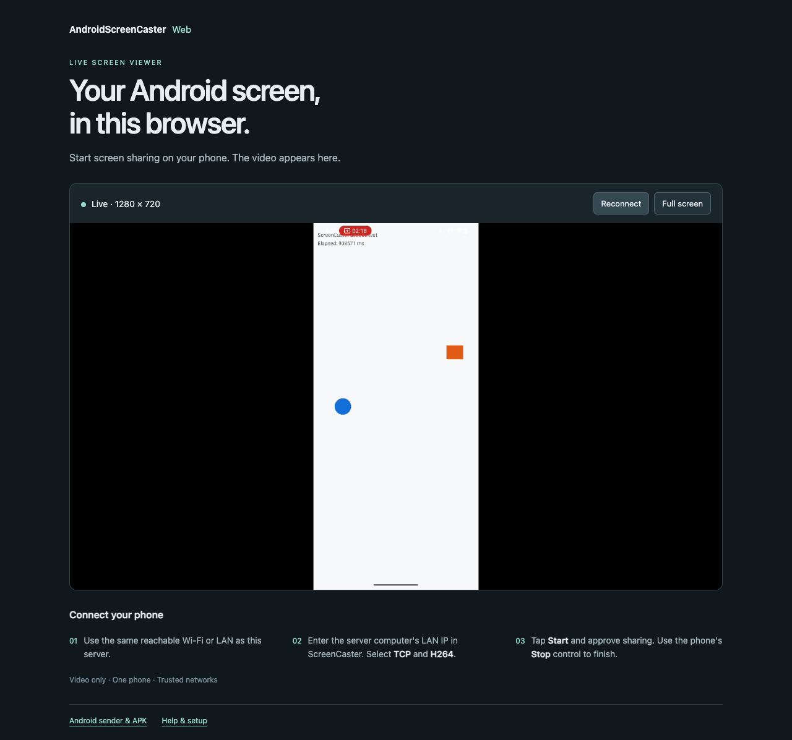

# AndroidScreenCasterWeb

[](https://github.com/magicsih/AndroidScreenCasterWeb/actions/workflows/ci.yml)
[](LICENSE)

A small **browser viewer for Android screen mirroring** with
[AndroidScreenCaster](https://github.com/magicsih/AndroidScreenCaster).
The existing Java Android app sends H.264 over TCP; FFmpeg receives it and
publishes to MediaMTX, which serves the video to a browser through WebRTC.
The viewer computer does not need FFplay.

[Explore the project website](https://magicsih.github.io/AndroidScreenCaster/) for the original demo, both projects, and a quick start.

**One phone, TCP/H.264, video only, trusted Wi-Fi/LAN.** The Android app and its
port **49152** stay unchanged. This viewer does not control the phone or capture
audio. Up to four browser viewers can join the same stream.



## Start the server

Install Docker with the Compose plugin, then:

```sh
git clone https://github.com/magicsih/AndroidScreenCasterWeb.git
cd AndroidScreenCasterWeb
docker compose up -d
```

Open **http://localhost:8080** on the server computer. The page waits for a phone.
MediaMTX and NGINX images are pinned by version and manifest digest; the included
FFmpeg is 8.1.2. There is no application build or package installation step.

## Send your Android screen

1. Install the [AndroidScreenCaster v0.2.0 example debug APK](https://github.com/magicsih/AndroidScreenCaster/releases/tag/v0.2.0).
2. Put the phone and server on a network that allows them to communicate. Find
   the server computer's LAN IP, for example `192.168.1.10`.
3. Enter **that LAN IP** in the Android app. Select **TCP / H264**. Start with
   **640×360 / 1 Mbps**.
4. Tap **Start** and approve Android screen sharing. Choose the entire screen if
   you want to switch between apps. Video appears in the browser.
5. Tap **Stop on the phone** to finish. Each new session requires fresh consent.
   The server automatically listens again, and open viewers reconnect.

USB is not required for normal LAN use. The Android device must have a suitable
Surface H.264 encoder. See the [sender's setup and device limits](https://github.com/magicsih/AndroidScreenCaster#faq-and-troubleshooting).

## View from another LAN device

Copy `.env.example` to `.env` and set your server's reachable LAN IP:

```dotenv
CAST_HOST=192.168.1.10
WEB_BIND=0.0.0.0:8080
```

Then run `docker compose up -d` again and visit `http://192.168.1.10:8080` from
the other computer or phone. `CAST_HOST` tells WebRTC which host to contact;
advertising a container's private IP would not work for outside viewers.

The server firewall must allow these ports only from intended trusted devices:

| Port | Purpose |
| --- | --- |
| TCP 49152 | Android H.264 input |
| TCP 8080 | Viewer page and WebRTC negotiation; localhost only by default |
| UDP / TCP 8189 | WebRTC video; TCP is also available if UDP cannot connect |

RTSP, the MediaMTX control API, publishing endpoints, and other streaming
protocols are not exposed. The input stream and HTTP page have no authentication
or encryption. WebRTC encrypts its media connection, which does not secure those
other legs. Keep this example on a trusted network; internet hosting needs a
separately designed access and transport setup.

## How it works

`Android → TCP/H.264 → FFmpeg → internal RTSP → MediaMTX → WebRTC → browser`

MediaMTX supervises an FFmpeg receiver with `runOnInit` and restarts it when a
sender disconnects. FFmpeg copies the encoded video without decoding or
re-encoding. NGINX serves the small static page and proxies only the WebRTC read
endpoint. The page uses MediaMTX's versioned WHEP reader, which handles connection
negotiation and retries; it reports Live only after a decoded frame arrives.

The Android raw H.264 stream carries no per-frame presentation timestamps. The
bridge assigns frame timestamps at the sender's configured **30 fps**. This is
not preservation of the original capture timing, and it does not guarantee a
particular delay on devices with variable frame delivery. Compatibility also
depends on the H.264 profile and absence of B-frames. The server does not silently
transcode incompatible video. See [validation](docs/VALIDATION.md) for measured
results and limits.

## Troubleshooting

**Port 49152 is already in use.** Choose a server where it is available. On macOS,
`rapportd` can use this port. Do not stop a system service just to run this demo.
For an optional USB development check, change `.env` to
`TCP_BIND=127.0.0.1:49153`, start the stack, and use:

```sh
adb reverse tcp:49152 tcp:49153
# In AndroidScreenCaster: 127.0.0.1, TCP / H264.
# Remove only this mapping afterwards:
adb reverse --remove tcp:49152
```

Changing the server's published port alone does not change the Android app's
fixed port. A normal Wi-Fi sender still needs TCP 49152 on its destination.

**Page loads but video does not.** Check that TCP/H264 is selected, the phone can
reach the server, sharing is approved, and `CAST_HOST` is reachable by the
browser. Allow 8189 for video as well as 8080 for the page. Guest Wi-Fi, VPNs,
client isolation, and firewalls can block either connection.

**Waiting after Stop.** This is expected. Start a new phone session; the receiver
can take a few seconds to listen again after EOF. The page retries automatically.
Use Reconnect to replace the browser connection without stopping the phone.

**Video stops or is incompatible.** Inspect `docker compose logs --tail 100` and
the browser console. Try a smaller resolution/bitrate. The first version accepts
H.264 without B-frames; VP8/IVF and legacy UDP input are not implemented here.

**Homebrew has only `docker-compose`.** That command also reads this Compose
file. Install/configure Docker's Compose plugin to use `docker compose` as shown
above. This repository does not modify your Docker configuration.

## Stop and test

```sh
docker compose logs --tail 100
docker compose down
```

CI on GitHub-hosted Linux validates configuration, decodes changing synthetic
video in Chromium, and checks late joining, manual reconnect, sender restart,
full screen, and a narrow layout. It has read-only repository permissions and
does not need Android devices or secrets. For an isolated Linux test environment:

```sh
python3 -m venv .venv
.venv/bin/pip install -r requirements-test.txt
.venv/bin/python -m playwright install --with-deps chromium
docker compose -p ascweb-ci up -d
.venv/bin/python tools/browser_checks.py
docker compose -p ascweb-ci down
```

Device video, actual browser display, and delay measurements are separate from
synthetic CI. See [docs/VALIDATION.md](docs/VALIDATION.md).

## Contributing and license

Read [CONTRIBUTING.md](CONTRIBUTING.md) and [SECURITY.md](SECURITY.md).
Project files use the [MIT license](LICENSE). Bundled third-party JavaScript and
container programs retain their own licenses; see
[THIRD_PARTY_NOTICES.md](THIRD_PARTY_NOTICES.md).

- [MediaMTX browser playback](https://mediamtx.org/docs/read/web-browsers)
- [MediaMTX FFmpeg publishing](https://mediamtx.org/docs/publish/ffmpeg)
- [WebRTC codec and connectivity limits](https://mediamtx.org/docs/features/webrtc-specific-features)
- [FFmpeg timestamp bitstream filter](https://ffmpeg.org/ffmpeg-bitstream-filters.html#setts)
